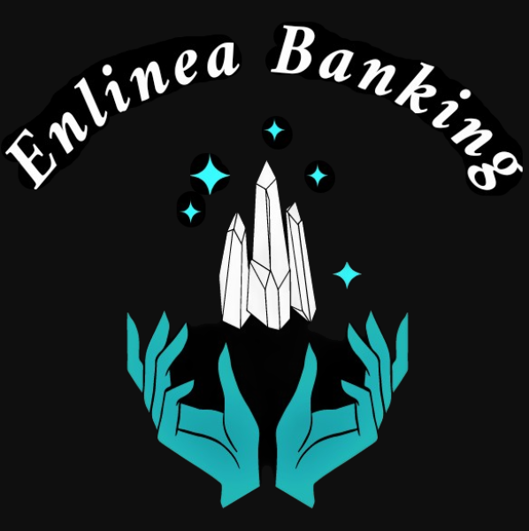

[![Contributors][contributors-shield]][contributors-url]
[![Forks][forks-shield]][forks-url]
[![Stargazers][stars-shield]][stars-url]
[![Issues][issues-shield]][issues-url]

<!-- PROJECT LOGO -->
<br />
<p align="center">
  <a href="https://github.com/MayukhC99/Enlinea_Banking_Server">
    
  </a>

  <h3 align="center">En línea Banking</h3>

  <p align="center">
    Your Personal E-Wallet combined with Social Networking facilities!
    <br />
    <a href="https://github.com/MayukhC99/Enlinea_Banking_Server"><strong>Explore the docs »</strong></a>
    <br />
    <br />
    <a href="https://github.com/MayukhC99/Enlinea_Banking_Server">View Demo</a>
    ·
    <a href="https://github.com/MayukhC99/Enlinea_Banking_Server/issues">Report Bug</a>
    ·
    <a href="https://github.com/MayukhC99/Enlinea_Banking_Server/issues">Request Feature</a>
  </p>
</p>


<!-- TABLE OF CONTENTS -->
## Table of Contents

* [About the Project](#about-the-project)
  * [Built With](#built-with)
* [Getting Started](#getting-started)
  * [Prerequisites](#prerequisites)
  * [Installation](#installation)
* [Roadmap](#roadmap)
* [Contributing](#contributing)
* [License](#license)
* [Contact](#contact)
* [Acknowledgements](#acknowledgements)


<!-- ABOUT THE PROJECT -->
## About The Project

This is your personal E-Wallet combined with Social Networking facilities. Here you can manage your bank account and your personal E-Wallet, send friend requests, build connections, chat with them and can even have video conferencing. It's an amazing way to stay connected and send money whenever required. Enlinea provides you with many other facilities and even a live support. Banking has never been so fun before.

Major facilities:
* Managing your Enlinea bank account and E-Wallet, transfer money, gift money to your near ones.
* Social media features, stay connected with friends, video calling, chatting and lots more.

We give top priority to our users security. Our web application is secure to any kind of money transaction.

A list of commonly used resources that I find helpful are listed in the acknowledgements.

### Built With
Some major frameworks/library used in this project:-
* [Bootstrap](https://getbootstrap.com)
* [JQuery](https://jquery.com)
* [Croppie](https://foliotek.github.io/Croppie/)
* [NodeJs](https://nodejs.org)
* [ExpressJs](https://expressjs.com/)
* [MySql2](https://www.npmjs.com/package/mysql2)
* [Passport](http://www.passportjs.org/)
* [Sequelize](https://sequelize.org/)


<!-- GETTING STARTED -->
## Getting Started

To get a local copy up and running follow these simple example steps.

### Prerequisites

This is an example of how to list things you need to use the software and how to install them.
* npm
```sh
npm install npm@latest -g
```

### Installation

1. Clone the repo
```sh
git clone https://github.com/MayukhC99/Enlinea_Banking_Server
```
2. Install NPM packages
```sh
npm install
```


<!-- USAGE EXAMPLES -->


<!-- ROADMAP -->
## Roadmap

See the [open issues](https://github.com/MayukhC99/Enlinea_Banking_Server/issues) for a list of proposed features (and known issues).


<!-- CONTRIBUTING -->
## Contributing

Contributions are what make the open source community such an amazing place to be learn, inspire, and create. Any contributions you make are **greatly appreciated**.

1. Fork the Project
2. Create your Feature Branch (`git checkout -b feature/AmazingFeature`)
3. Commit your Changes (`git commit -m 'Add some AmazingFeature'`)
4. Push to the Branch (`git push origin feature/AmazingFeature`)
5. Open a Pull Request


<!-- LICENSE -->
## License

Distributed under the MIT License. See `LICENSE` for more information.


<!-- CONTACT -->
## Contact

Your Name - [Enlinea Banking](enlineabanking@gmail.com) - enlineabanking@gmail.com

Project Link: [https://github.com/MayukhC99/Enlinea_Banking_Server](https://github.com/MayukhC99/Enlinea_Banking_Server)


<!-- ACKNOWLEDGEMENTS -->
## Acknowledgements
* [GitHub Pages](https://pages.github.com)
* [Animate.css](https://daneden.github.io/animate.css)
* [Loaders.css](https://connoratherton.com/loaders)
* [Slick Carousel](https://kenwheeler.github.io/slick)
* [Smooth Scroll](https://github.com/cferdinandi/smooth-scroll)
* [Sticky Kit](http://leafo.net/sticky-kit)
* [JVectorMap](http://jvectormap.com)
* [Font Awesome](https://fontawesome.com)


<!-- MARKDOWN LINKS & IMAGES -->
<!-- https://www.markdownguide.org/basic-syntax/#reference-style-links -->
[contributors-shield]: https://img.shields.io/badge/Contributors-2-green
[contributors-url]: https://github.com/MayukhC99/Enlinea_Banking_Server/graphs/contributors
[forks-shield]: https://img.shields.io/github/forks/MayukhC99/Enlinea_Banking_Server
[forks-url]: https://github.com/MayukhC99/Enlinea_Banking_Server/network/members
[stars-shield]: https://img.shields.io/github/stars/MayukhC99/Enlinea_Banking_Server
[stars-url]: https://github.com/MayukhC99/Enlinea_Banking_Server/stargazers
[issues-shield]: https://img.shields.io/github/issues/MayukhC99/Enlinea_Banking_Server
[issues-url]: https://github.com/MayukhC99/Enlinea_Banking_Server/issues
[license-shield]: https://img.shields.io/github/license/othneildrew/Best-README-Template.svg?style=flat-square
[license-url]: https://github.com/othneildrew/Best-README-Template/blob/master/LICENSE.txt
[linkedin-shield]: https://img.shields.io/badge/-LinkedIn-black.svg?style=flat-square&logo=linkedin&colorB=555
[linkedin-url]: https://linkedin.com/in/othneildrew
[product-screenshot]: images/screenshot.png
